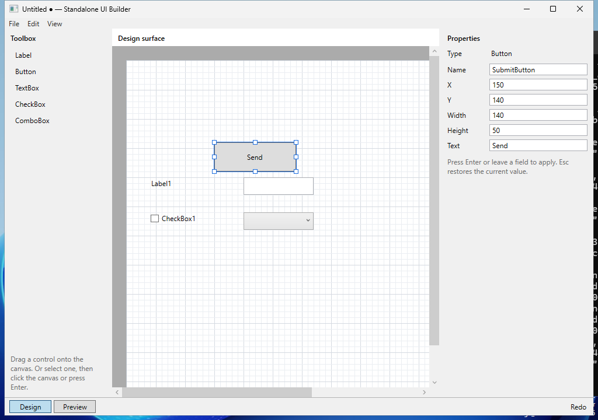
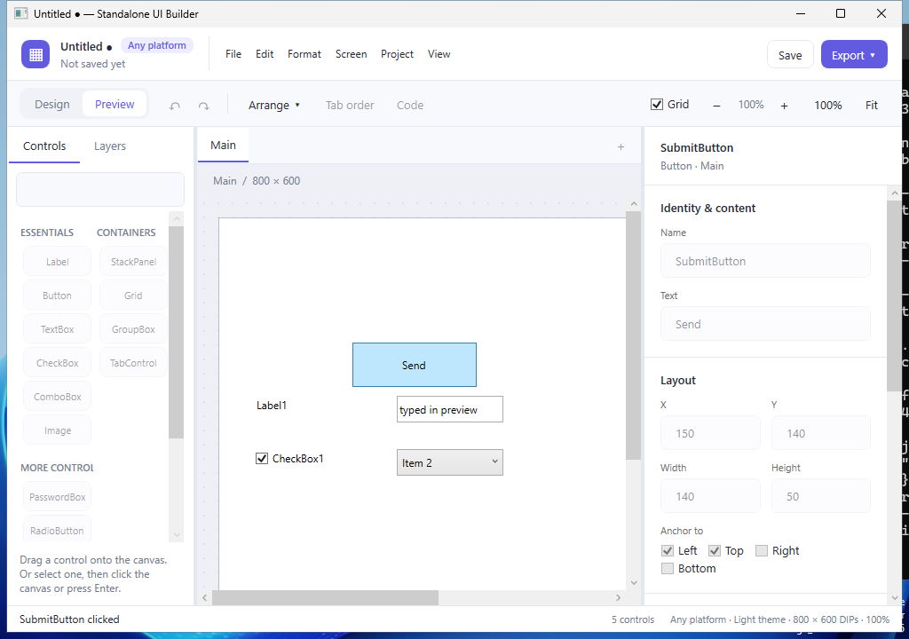

# Standalone UI Builder

A Windows desktop designer for placing and editing controls on a gridded canvas, saving the
design as a project file, and exporting it as a ready-to-build WPF, WinForms or Blazor
application. Design
choices are recorded in `docs/decisions.md`.

## What it does

- **Place controls.** Drag Label, Button, TextBox, PasswordBox, CheckBox, RadioButton,
  ComboBox, ListBox, Slider, ProgressBar or DatePicker from the toolbox onto the 800 × 600
  canvas. Or select a toolbox item and then click the canvas, or press Enter.
  Placement snaps to the 10-DIP grid.
- **Edit.** Click a control to select it. Drag it to move it, or drag its handles to resize
  it. Moves and resizes snap to the grid and stay inside the canvas. Delete removes the
  selected control.
- **Properties.** The Properties panel edits name, X, Y, width and height for every control,
  plus text, checked state, list items (one per line), a Slider's or ProgressBar's minimum,
  maximum and value, or a TextBox's multi-line option where they apply. Press Enter or
  leave a field to apply it; Esc restores the stored value. Invalid values are flagged in red
  and never written to the design.
- **Anchoring.** Each control's Anchor setting (Left, Top, Right, Bottom) says which window
  edges it follows when the window is resized: anchored to Right it moves with the right
  edge, anchored to Left and Right it stretches. Dashed lines show the anchors of the
  selected control. In Preview, drag the corner grip to try them.
- **Containers.** StackPanel lines controls up vertically or horizontally with a gap;
  GroupBox does the same inside a titled frame; Grid
  divides itself into equal rows and columns with one control per cell. Drag or click a
  toolbox item into a container, or drag a control in or out; the target container is
  outlined in green. Inside a stack a control keeps its height (or width) and stretches
  across; in a grid it fills its cell. Containers can be nested and anchored like any
  control, so whole groups resize with the window. The Properties panel sets a stack's
  direction and spacing, a grid's rows and columns and their sizes (fixed DIPs like `100`,
  or shares of the rest like `*` and `2*`), and a control's order, or its cell and how many
  rows and columns it spans.
- **Work with several controls.** Ctrl+click, or drag a box across empty canvas, to select
  several controls; drag, nudge (arrow keys, Shift for a grid step), copy, cut, paste,
  duplicate (Ctrl+D) or delete them together. Ctrl+A selects all. Edit > Bring to Front
  (Ctrl+]) and Send to Back (Ctrl+[) change which control is drawn on top.
- **Screens.** A project can have several screens, shown as tabs above the canvas. The
  Screen menu adds (Ctrl+Shift+N, or the + beside the tabs), duplicates, deletes and reorders
  them; Ctrl+PageUp and Ctrl+PageDown switch between them. The first screen is the one an
  exported app opens with; each other screen becomes its own window or form. A Button's "On
  click" setting can open another screen as a dialog or close its own, in Preview and in
  exported apps. With nothing selected, the Properties panel sets the screen's name, width and
  height.
- **Undo and redo.** Ctrl+Z and Ctrl+Y cover adding, deleting, moving, resizing and property
  changes, and screen changes. A whole drag is one step. Undo shows the screen the change
  was on.
- **Preview.** Switch to Preview (bottom left, or View > Preview) to try the controls. Type
  in text boxes, tick check boxes, pick ComboBox items and click buttons. Nothing you do in
  Preview changes the design.
- **Save and open.** File > New, Open, Save (Ctrl+S) and Save As (Ctrl+Shift+S) work with
  `.uibproj` files. The title shows ● when there are unsaved changes, and you are asked to
  Save, Discard or Cancel before they could be lost.
- **Recovery.** If the editor closes unexpectedly, it offers to recover your unsaved work
  the next time it starts.
- **Export to WPF, WinForms or Blazor.** File > Export to WPF… (Ctrl+E), Export to WinForms…
  (Ctrl+Shift+E) or Export to Blazor… writes a complete project into a folder you choose. Build it with
  `dotnet build` or open it in Visual Studio. Exporting again rewrites only the generated
  layout and event files, so code you add is kept. Each Button, CheckBox, TextBox and
  ComboBox has a hook method you can fill in to respond to it. See
  [`docs/wpf-output.md`](docs/wpf-output.md), [`docs/winforms-output.md`](docs/winforms-output.md) and
  [`docs/blazor-output.md`](docs/blazor-output.md). The Blazor app is a web app: run it with
  `dotnet run` and open it in a browser.

Try it with the samples: File > Open > `docs\samples\customer-form.uibproj`, or
`docs\samples\layout-demo.uibproj` for containers and a second screen.

| Design | Preview |
|---|---|
|  |  |

More in [`docs/screenshots`](docs/screenshots): the sample project, and a draft recovered
after a forced close. All were captured on Windows by the CI walkthrough.

## Open in Visual Studio

1. Install Visual Studio 2026 (or 2022 17.14 or later) with the **.NET desktop development**
   workload, and the [.NET 10 SDK](https://dotnet.microsoft.com/download/dotnet/10.0) if
   Visual Studio did not install it.
2. Open `StandaloneUiBuilder.sln`.
3. Make sure **StandaloneUiBuilder** is the startup project (right-click it > Set as Startup
   Project), then press F5.

To open the sample at startup while debugging, set it as the command-line argument in the
project's debug properties.

## Build and run from the command line

Requires Windows 10 or 11 and the .NET 10 SDK (10.0.100 or a later 10.0 feature band; see
`global.json`). Visual Studio is not needed.

```powershell
dotnet build StandaloneUiBuilder.sln
dotnet run --project src/StandaloneUiBuilder
dotnet run --project src/StandaloneUiBuilder -- docs\samples\customer-form.uibproj
```

## Release build

A self-contained, single-file build runs without Visual Studio or an installed .NET runtime:

```powershell
dotnet publish src/StandaloneUiBuilder/StandaloneUiBuilder.csproj -c Release -r win-x64 --self-contained true -p:PublishSingleFile=true -p:IncludeNativeLibrariesForSelfExtract=true -o publish
publish\StandaloneUiBuilder.exe
```

CI builds the same thing on every push. Download it from the run's
`StandaloneUiBuilder-win-x64` artifact on the repository's Actions page.

## Tests

```powershell
dotnet test StandaloneUiBuilder.sln
```

- `tests/StandaloneUiBuilder.Core.Tests` covers the document model, editing rules, undo,
  saving and loading, and recovery. It also runs on Linux and macOS.
- `tests/StandaloneUiBuilder.UiTests` is an end-to-end walkthrough of the prototype
  acceptance steps, plus checks that editing stays responsive with 60 controls and that
  Tab reaches the toolbox and Properties panel. It drives the real editor with the mouse and keyboard, so it is skipped
  unless you opt in:

  ```powershell
  $env:UIB_RUN_UI_TESTS = "1"
  dotnet test tests/StandaloneUiBuilder.UiTests
  ```

  Leave the mouse and keyboard alone while it runs. It assumes 100% display scaling.
  Screenshots go to `artifacts/ui-walkthrough`.
- `tests/StandaloneUiBuilder.Web.Tests` exports the samples to Blazor, runs them and checks
  every page in a browser (Edge on Windows, or the Chromium at `UIB_CHROMIUM`). It is also
  opt-in: set `UIB_RUN_WEB_TESTS=1`.

## Recovery copies

While a project has unsaved changes, a recovery copy is written two seconds after the last
edit to `%LOCALAPPDATA%\StandaloneUiBuilder\Recovery`. It is deleted when you save, discard
or close normally. Recovery copies never overwrite your project file. Setting the
`UIB_RECOVERY_DIR` environment variable stores them in a different folder instead; the UI
tests use this so they never touch your own drafts.

## Known limitations

- Buttons can open and close screens, but there are no other actions (such as passing
  values between screens); those go in the hooks.
- Eleven built-in controls and three containers; no tabs, images, menus or data grids yet.
  RadioButtons group by the container they are in. Grid rows and columns can be fixed or shared,
  but not sized to their content. Copy and paste stay within the editor rather than using the system clipboard.
- Layout is absolute positions plus anchors, with StackPanel and Grid containers.
- Output is WPF, WinForms and Blazor. It covers layout and one event hook per control; there is no
  data binding, styling, or import of existing projects.
- The automated UI tests assume 100% display scaling. 150% scaling has been checked by hand.
- Only the most recent recovery draft is offered at each start; older ones wait for later
  starts.

## Repository layout

```text
StandaloneUiBuilder.sln
src/StandaloneUiBuilder/              WPF editor: window, design surface, preview
src/StandaloneUiBuilder.Core/         Document model, editing rules, undo, file format, recovery
src/StandaloneUiBuilder.Output/       Shared naming and export-to-folder rules for the generators
src/StandaloneUiBuilder.Output.Wpf/   Generates a WPF project from a design (no WPF dependency)
src/StandaloneUiBuilder.Output.WinForms/ Generates a WinForms project (no WinForms dependency)
src/StandaloneUiBuilder.Output.Blazor/ Generates a Blazor web app (no ASP.NET Core dependency)
tests/StandaloneUiBuilder.Core.Tests/ Unit tests for Core and both generators
tests/StandaloneUiBuilder.UiTests/    Windows tests: UI walkthrough (opt-in), output layout checks
tests/StandaloneUiBuilder.Web.Tests/  Browser checks of the Blazor output (opt-in)
docs/                                 Decisions, project file format and samples
```

## Continuous integration

`.github/workflows/windows-build.yml` runs on a Windows runner on every push:

1. Builds the solution and runs the Core tests.
2. Runs the UI walkthrough and the output tests, exports the sample project to WPF and
   WinForms, then builds and runs both generated apps.
3. Builds and runs the Blazor export of both samples and checks every page in Edge.
4. Opens the sample project and takes a screenshot.
5. Uploads every screenshot as the `screenshots` artifact, and also prints each one to the
   job log as base64 between `SCREENSHOT-BASE64-BEGIN <name>` and `SCREENSHOT-BASE64-END`.
6. Publishes the self-contained build, checks that it starts, and uploads it.
