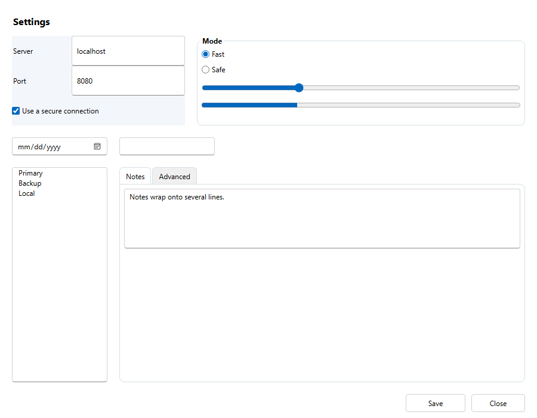

# Blazor output

File > Export to Blazor… turns the design into a Blazor web app: .NET 10, interactive server
rendering, one page per screen. Run it with `dotnet run` in the exported folder and open the
address it prints, or open the `.csproj` in Visual Studio. Like the WPF and WinForms output,
it is text generated from the design; the generator does not depend on ASP.NET Core.



## What is generated

Exporting "Layout demo" into `C:\Exports` produces `C:\Exports\LayoutDemo\`:

| File | Contents | On re-export |
|---|---|---|
| `LayoutDemo.csproj`, `Program.cs` | A `net10.0` Blazor web app with interactive server rendering | Kept |
| `Components/App.razor`, `Routes.razor`, `_Imports.razor`, `Layout/MainLayout.razor` | The usual Blazor app shell | Kept |
| `wwwroot/app.css` | Your own styles | Kept |
| `wwwroot/uib.css` | The styles the layout relies on | **Regenerated** |
| `Components/Pages/MainPage.razor` | The first screen's page, at `/` | **Regenerated** |
| `Components/Pages/MainPage.Events.g.cs` | Its control values, event wiring and hooks | **Regenerated** |
| `Components/Pages/MainPage.razor.cs` | Your code for the page | Kept |
| `Components/Pages/SettingsPage.*` | The same for each further screen, at `/settings` | As above |

Pages are named like the WPF windows: the first screen is always `MainPage` at `/`, and every
other screen is named after itself, with its name in lower case as its address.

## How the design maps to HTML and CSS

- The page has the design size. If any control is anchored to the right or bottom, the page
  fills the browser window instead, never smaller than the design size.
- A control on the screen is absolutely positioned: `left` and `width` when anchored left,
  `right` and `width` when anchored right, `left` and `right` when anchored to both; the same
  vertically. So it moves and stretches with the window exactly as the anchors say.
- A **StackPanel** is a flex box in its direction. Each child keeps its size along it,
  stretches across it and has the spacing as a leading margin.
- A **Grid** is a CSS grid with the same tracks: `60px` for a fixed size, `2fr` for a share.
  Each child has `grid-row` and `grid-column` with its span.
- A **GroupBox** is a framed box with its title, and its children in a flex box 8 pixels in
  from the sides and bottom and 20 from the top, as in the design.
- A **TabControl** is a row of tab buttons over a frame, with each page a flex box 8 pixels in
  from the sides and bottom and 36 from the top. An `int` field named after the TabControl
  holds the index of the page shown; every other page has the `hidden` attribute. Clicking a
  tab sets the field and calls the hook.
- Every element uses border-box sizing, so its box is exactly the designed size.
- Text size, bold and colours become `font-size`, `font-weight`, `color` and
  `background-color`. A GroupBox's font and text colour style its title, and its background
  fills its frame.
- Each control's name is its element `id`, for your own CSS and scripts.

| Control | HTML |
|---|---|
| Label | `<span>` |
| Button | `<button>` |
| TextBox | `<input type="text">`, or `<textarea>` when multi-line |
| PasswordBox | `<input type="password">` |
| CheckBox, RadioButton | `<label>` holding an `<input type="checkbox">` or `"radio"` and the text |
| ComboBox | `<select>`, starting with nothing chosen |
| ListBox | `<select size="…">`, showing its items as a list |
| Slider | `<input type="range">` with the minimum, maximum and a step of 1 |
| ProgressBar | `<progress>` |
| DatePicker | `<input type="date">` |
| Image | `` with `object-fit: contain` (or `fill`), its picture in `wwwroot/Assets/<screen>/` |

## Control values and hooks

Each control that holds a value has a field named after it in the page, starting from the
design: a `string` for text boxes, password boxes, ComboBoxes and ListBoxes (the chosen item),
a `bool` for check boxes and radio buttons, an `int` for Sliders and ProgressBars, and a
`DateOnly?` for DatePickers. The controls are bound to these fields, so your code reads and
changes them; set `UploadProgress = 80;` and the progress bar follows.

Each control you can interact with has a hook, a partial method you implement in the page's
`.razor.cs` file. The hooks have the same names as in the WPF output (`OnSaveButtonClick`,
`OnNameTextBoxTextChanged`, `OnLevelSliderValueChanged`), but take no arguments, since the
values are in the fields:

```csharp
public partial class MainPage
{
    partial void OnSubmitButtonClick() => Console.WriteLine($"Submitted {NameTextBox}");
}
```

A RadioButton clears the other radio buttons in its container (or on the screen) before its
hook runs. A Button set to open a screen goes to that screen's page after its hook; one set
to close its screen goes back to the previous page, since a web page cannot close itself.

## Checks

- Unit tests check the generated markup, CSS and code, and parse the C# with Roslyn.
- A browser test (`tests/StandaloneUiBuilder.Web.Tests`, opt-in with `UIB_RUN_WEB_TESTS=1`)
  exports both samples, builds and runs them, and reads every control's box on every page
  from the browser's own layout: at the design size and, for resizable screens, larger. It
  also follows the layout demo's OK and Close buttons and checks a radio group. CI runs it
  in Edge on Windows; elsewhere it uses a Chromium given by `UIB_CHROMIUM`.

## Not generated yet

Styling beyond the browser's own control look, data binding to anything but the page's own
fields, and anything that needs JavaScript of your own. Fonts and control chrome are the
browser's, so text sits slightly differently than in WPF.
