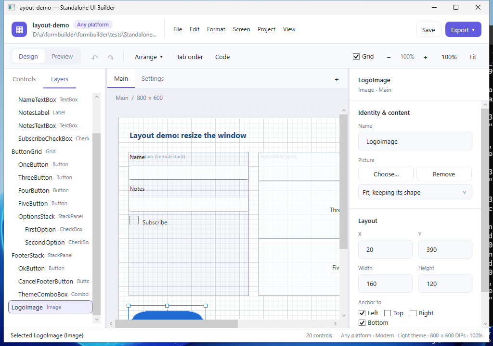

# Standalone UI Builder: user guide

Standalone UI Builder lays out desktop and web screens by drag and drop, and exports them as
ordinary projects: WPF, Windows Forms, WinUI 3, .NET MAUI or Blazor. This guide covers the
editor. The files in `docs/` go deeper on each output and on the project format.

## Getting started

Install it with `StandaloneUiBuilder.msi`, or run `StandaloneUiBuilder.exe` from the release
build; neither needs .NET installed. The installer adds a Start menu shortcut and two sample
projects (in the install folder's `Samples`), and double-clicking a `.uibproj` file opens it.
Open `layout-demo.uibproj` to see most features at work.

## Choosing a platform

A new project (File > New, or starting the editor without one) asks which platform it is
for: **WPF**, **Windows Forms**, **WinUI 3**, **.NET MAUI** or **Blazor**. The platform decides
what Export writes and which control libraries you can add. **Any platform** keeps the choice
open: the project exports to all five, with the built-in controls only. The chip next to the
project's name, or Project > Platform, changes it.

## The workspace

- **Header:** the project's name, platform and file, the menus (File, Edit, Format, Screen,
  Project, View), **Save**, and **Export**: straight to the project's platform, or a list of
  the five targets for any platform.
- **Action bar:** **Design** and **Preview**; undo and redo; **Arrange** for the selected
  controls; **Tab order**; **Code** for the screen's view model code; **Grid** to show or
  hide the design grid; and zoom (−, +, 100%, Fit).
- **Left panel:** **Controls**, the toolbox, with a search box; and **Layers**, the screen's
  controls inside their containers.
- **Middle:** a tab for each screen (+ adds one), the screen's size, and the canvas.
- **Right panel:** the inspector for the selected control, or the screen's settings when
  nothing is selected.
- **Status bar:** what just happened, the number of controls, and the project's theme, screen
  size and zoom.

The editor follows Windows' light or dark app setting. A project's own theme (below) is
separate: it is how the screens you design look.

## Placing and editing controls

- **Add** a control by dragging it from the toolbox onto the canvas, or select it in the
  toolbox and click the canvas or press Enter. Drop it on a container to put it inside.
- **Select** by clicking, Ctrl+click to add to the selection, or drag a box across empty
  canvas. Layers selects too. Ctrl+A selects everything.
- **Move** by dragging, or with the arrow keys (one DIP, or one grid square with Shift); **resize** with the
  handles. Positions snap to the grid, even when it is hidden.
- **Copy, cut, paste, duplicate (Ctrl+D) and delete**, and **bring to front** (Ctrl+]) or
  **send to back** (Ctrl+[).
- **Arrange** lines up, sizes or spaces two or more selected controls; the last one selected
  is the one the others follow.
- **Undo and redo** (Ctrl+Z, Ctrl+Y) cover every change.
- **Zoom** with Ctrl+wheel, Ctrl++ and Ctrl+−, Ctrl+0 for actual size, or Fit. The design is
  always in DIPs; zoom only changes how large it is drawn.

## The inspector

Fields apply when you press Enter or leave them; Esc puts the current value back. A field
that cannot take a value turns red and says why.

- **Identity & content:** the name (it becomes the control's name in code), text, list
  items, checked state, multi-line text, a slider's range, a picture, a TabControl's tabs.
- **Layout:** position and size, and the **anchors**: the edges a control follows when the
  window is resized (both left and right, or top and bottom, make it stretch). Inside a
  container, the container decides: a StackPanel's order and spacing, a Grid's cell and span,
  its rows and columns and their sizes (100 for DIPs, * or 2* for shares of what is left).
- **Appearance:** text size, bold, and text and background colours as `#RRGGBB`.
- **Interaction:** for buttons, **On click** (open a screen or close this one), **Command**
  and **Enabled when**; for controls with a value, **Binding** (see Data binding).

With nothing selected, the inspector edits the screen: its name and design size.

## Containers

- **StackPanel** lines controls up, vertically or horizontally, with a gap.
- **Grid** puts controls in cells; a control can span several.
- **GroupBox** is a titled frame that stacks its controls.
- **TabControl** holds pages, one shown at a time: click a tab on the canvas, or choose the
  shown tab in the inspector; **Add tab** adds a page.

## Screens

Each screen becomes a window (or a page on the web). The first is the one the application
opens with. The Screen menu adds (Ctrl+Shift+N), duplicates, deletes and reorders screens;
Ctrl+PgUp and Ctrl+PgDn move between them. A button's **On click** can open another screen as a
dialog, or close its own.

## Preview

**Preview** (in the action bar or the View menu) turns the canvas into the running screen:
type, tick, choose and click. Buttons open and close screens as they will in the exported
application. Drag the corner grip to see how anchored controls move and stretch. Nothing you
do in Preview changes the design.

## Tab order

**Tab order** (Ctrl+T) numbers the controls Tab visits; click them in the order Tab should go,
then press Esc. The Format menu can also order them top to bottom and left to right, or reset
them to the order they were added.

## Themes

**Project > Theme** makes the whole project light, dark, or follow the computer's (or
browser's) setting. The canvas and Preview show it, and every export uses its target's own
dark theme. Text on a background colour you chose always gets black or white, whichever
stands out.

## Data binding, commands and code

Each screen can have a **view model**: a class, generated with the export, that holds the
screen's values so your code works with values rather than controls.

- **Binding:** give a control's Binding field a name, such as `CustomerName`. The view model
  gets a property of that name, starting from the design's value. Controls that share a name
  share the value: a label can show what a text box holds, or a progress bar follow a slider.
- **Command:** give a button's Command field a name, such as `Save`. Clicking the button runs
  the view model's `Save`, which runs your `OnSave`.
- **Enabled when:** give a button an on-or-off property, such as `CanSave`, to enable it only
  while it is on; a check box bound to the same name turns it on and off.
- **Code** (Screen > Code, F7): write the view model's code in the builder, for example
  `partial void OnSave() => Status = "Saved";`. The list beside the code shows the hooks you can
  write (each command's `On…`, and each property's `On…Changed`); double-click one to start it.
  The code is saved in the project and written into every export.

Names start with a capital letter. Each target gets the types its controls use; where they
differ (a number is whole in Windows Forms and Blazor), write code that suits both.

## Export

**Export** (or the File menu) asks for a folder and writes a project there that builds with
the .NET SDK: WPF (Ctrl+E), Windows Forms (Ctrl+Shift+E), WinUI 3, .NET MAUI or Blazor.
Exporting again updates the builder's own files and never touches yours: each control's
**hook**, a method in the code-behind you can fill in (for example `OnSaveButtonClick`), lives
in files the builder creates once and then leaves alone. If a file the builder would rewrite
was not written by it, the export stops and changes nothing.

## Importing from WPF

**File > Import from WPF…** reads WPF window XAML into a new project: positions, the controls
and containers the builder has, text, fonts, colours, tab order, bindings and theme. Anything
it cannot keep is listed.

## Saving and recovery

Projects are `.uibproj` files (JSON). The title and header show ● when there are unsaved
changes, and the editor asks before closing, opening or starting another. If the editor stops
unexpectedly, it offers your unsaved work the next time it starts.

## Keyboard shortcuts

| Keys | Does |
|---|---|
| Ctrl+N, Ctrl+O, Ctrl+S, Ctrl+Shift+S | New, open, save, save as |
| Ctrl+E, Ctrl+Shift+E | Export to WPF, to Windows Forms |
| Ctrl+Z, Ctrl+Y | Undo, redo |
| Ctrl+C, Ctrl+X, Ctrl+V, Ctrl+D, Delete | Copy, cut, paste, duplicate, delete |
| Ctrl+A | Select all |
| Arrow keys, Shift+arrow keys | Move the selection a DIP, or a grid square |
| Ctrl+], Ctrl+[ | Bring to front, send to back |
| Ctrl+T | Set the tab order |
| F7 | The screen's code |
| Ctrl+Shift+N | Add a screen |
| Ctrl+PgUp, Ctrl+PgDn | Previous and next screen |
| Ctrl++, Ctrl+−, Ctrl+0, Ctrl+wheel | Zoom in, out, actual size, zoom |
| Enter (in the toolbox) | Add the chosen control |
| Esc | Put a field's value back; finish setting the tab order |
