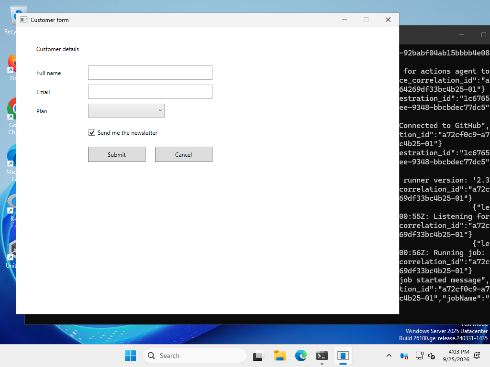

# WPF output

The builder can turn a project into a complete WPF application that builds with
`dotnet build` and opens a window matching the design.

The generator lives in `src/StandaloneUiBuilder.Output.Wpf`. It only produces text, does not
depend on WPF, and never changes the builder project.



*The sample project after export, built with `dotnet build` and running on Windows (captured
by CI). The same sample exported to WinForms is in
[`screenshots/generated-winforms-app.png`](screenshots/generated-winforms-app.png).*

## What is generated

Exporting a project named "Customer form" into a folder `C:\Exports` produces
`C:\Exports\CustomerForm\`:

| File | Contents | On re-export |
|---|---|---|
| `CustomerForm.csproj` | A `net10.0-windows` WPF application | Kept |
| `App.xaml`, `App.xaml.cs` | Starts `MainWindow` | Kept |
| `MainWindow.xaml` | The window and every control | **Regenerated** |
| `MainWindow.xaml.cs` | Constructor calling `InitializeComponent()` | Kept |
| `MainWindow.Events.g.cs` | Event wiring and hooks (below) | **Regenerated** |
| `SettingsWindow.xaml`, `.xaml.cs`, `.Events.g.cs` | The same three files for each further screen, named after it | As for `MainWindow` |

Each screen becomes its own window. The first screen is always `MainWindow`, which the app
opens with; every other screen is named after itself, so a screen called Settings becomes
`SettingsWindow` (titled "Settings"). A button set to open it shows it as a dialog (see
below); your own code can open it too, with `new SettingsWindow { Owner = this }.ShowDialog()`.

Only the `.xaml` and `.Events.g.cs` files are rewritten on later exports. The other files are created once and
then belong to you, so code you add to `MainWindow.xaml.cs` survives design changes. If a
file's content would not change, it is not rewritten.

The namespace comes from the project name ("Customer form" → `CustomerForm`). If the folder
already holds an earlier export, its namespace is kept, so a renamed project still matches
existing code-behind.

## How the design maps to XAML

- The window is titled with the project name and opens at the design size
  (`SizeToContent="WidthAndHeight"`).
- Controls go in a `Grid`, in draw order. Each control's anchors become
  `HorizontalAlignment`, `VerticalAlignment`, `Margin` and, where it does not stretch, `Width`
  and `Height`:

  | Anchor (one axis) | Alignment | Margin | Size |
  |---|---|---|---|
  | left only | `Left` | distance from left | fixed |
  | right only | `Right` | distance from right | fixed |
  | left and right | `Stretch` | both distances | stretches |

  Top and bottom work the same way vertically.
- A **StackPanel** becomes a WPF `StackPanel` with its `Orientation`. Each child keeps its
  `Height` (vertical) or `Width` (horizontal), stretches across the stack, and has the
  spacing as a leading `Margin`. Overflow is clipped (`ClipToBounds`).
- A **Grid** becomes a WPF `Grid` whose `RowDefinition` heights and `ColumnDefinition` widths
  are the design's sizes, in the same notation (`60`, `*`, `2*`); each child has `Grid.Row`
  and `Grid.Column` (plus `Grid.RowSpan`/`Grid.ColumnSpan` when it spans cells) and stretches
  to fill them.
- A **GroupBox** becomes a `Grid` holding a WPF `GroupBox` (named after the design, with its
  text as `Header`) and, over it, a `StackPanel` with `Margin="8,20,8,8"` for the children.
  The fixed margin puts children exactly where the design has them, whatever the theme's
  frame looks like.
- A **TabControl** becomes a `Grid` holding a WPF `TabControl` (named after the design, with an
  empty `TabItem` per page and `SelectedIndex` from the design) and, over it, each page as a
  `StackPanel` named after it with `Margin="8,36,8,8"`, all but the chosen one `Collapsed`.
  Its `SelectionChanged` handler in `.Events.g.cs` shows the page whose tab is chosen, then
  calls the hook (`OnDetailsTabsSelectionChanged`). The pages sit beside the TabControl rather
  than in it so they are exactly where the design has them, whatever height the theme gives
  the tabs.
- Containers nest in the XAML exactly as in the design.
- If any control is anchored to the right or bottom edge, the window can be resized
  (`ResizeMode="CanResize"`) and the Grid has the design size as its minimum. Otherwise the
  window keeps the design size and can only be minimised.
- Each control's name becomes its `x:Name`, so it is a field you can use from code-behind.
- Label, Button, CheckBox and RadioButton text becomes `Content`, TextBox text becomes `Text`,
  checked states become `IsChecked`, and ComboBox and ListBox items become `ComboBoxItem`s and
  `ListBoxItem`s in order. A multi-line TextBox gets `AcceptsReturn`, `TextWrapping="Wrap"`
  and a vertical scroll bar when needed. Slider and ProgressBar get `Minimum`, `Maximum` and
  `Value`; a Slider snaps to whole numbers. PasswordBox and DatePicker start empty.
- RadioButtons group by their parent, as the design does: those on the screen are one group,
  and those in each container another.
- An **Image** becomes a WPF `Image` with `Stretch="Uniform"` or `"Fill"`. Its picture is
  written to `Assets/<screen>/<control>.png` (or `.jpg` and so on) and built into the
  application as a resource; the project file includes `Assets\**` for that. A project
  exported before the builder had images needs that line added to its `.csproj`.
- A control's text size, bold and colours become `FontSize`, `FontWeight="Bold"`,
  `Foreground` and `Background`.
- The same padding and alignment the designer uses are written out (Label `Padding="2,0"`,
  vertically centred content), so the window looks like the design surface.
- Text is XML-escaped. Underscores in Label, Button and CheckBox text are doubled so WPF
  shows them rather than treating them as access keys, matching the designer. Text starting
  with `{` is escaped so it is not read as a binding.

Example (`docs/samples/customer-form.uibproj`):

```xml
<Grid MinWidth="800" MinHeight="600">
    <Label x:Name="NameLabel" HorizontalAlignment="Left" VerticalAlignment="Top" Margin="40,80,0,0" Width="100" Height="30" Padding="2,0" VerticalContentAlignment="Center" Content="Full name" />
    <TextBox x:Name="NameTextBox" HorizontalAlignment="Stretch" VerticalAlignment="Top" Margin="150,80,390,0" Height="30" VerticalContentAlignment="Center" Text="" TextChanged="NameTextBox_TextChanged" />
    <ComboBox x:Name="PlanComboBox" HorizontalAlignment="Left" VerticalAlignment="Top" Margin="150,160,0,0" Width="160" Height="30" VerticalContentAlignment="Center" SelectionChanged="PlanComboBox_SelectionChanged">
        <ComboBoxItem Content="Basic" />
        ...
    </ComboBox>
    <Button x:Name="SubmitButton" HorizontalAlignment="Right" VerticalAlignment="Top" Margin="0,250,530,0" Width="120" Height="32" Content="Submit" Click="SubmitButton_Click" />
</Grid>
```

## Tab order

When the screen has a tab order of its own, each control Tab visits gets its place in it as
`TabIndex`, which WPF compares across the whole window. A DatePicker or TabControl also gets
`KeyboardNavigation.TabNavigation="Local"`, so Tab goes through its own parts (the date text
and calendar button, the tabs) before moving on. Without a tab order, nothing is numbered and
Tab follows the order of the XAML, which is the design's order.

## Theme

A Light project uses WPF's usual look. Dark and System projects use WPF's Fluent theme:
each window gets `ThemeMode="Dark"` or `ThemeMode="System"` (the latter follows Windows'
app mode), and every control gets `MinWidth="0" MinHeight="0"`, since Fluent's styles
would otherwise make some controls larger than the design (a text box at least 32 high).
Text drawn on a background the design sets (a control's own, or the container behind a label,
check box, radio button or group title) gets black or white, whichever stands out, unless it
has a text colour of its own, so it stays readable in a dark theme.

## Responding to controls

Every control you can interact with is wired to one event, and each has a *hook*: a partial
method you can implement in the window's `.xaml.cs` file. Labels, ProgressBars and
containers have none.

| Control | Event | Hook to implement |
|---|---|---|
| Button | `Click` | `partial void On<Name>Click(RoutedEventArgs e)` |
| CheckBox | `Click` | `partial void On<Name>Click(RoutedEventArgs e)` |
| TextBox | `TextChanged` | `partial void On<Name>TextChanged(TextChangedEventArgs e)` |
| ComboBox | `SelectionChanged` | `partial void On<Name>SelectionChanged(SelectionChangedEventArgs e)` |
| RadioButton | `Click` | `partial void On<Name>Click(RoutedEventArgs e)` |
| ListBox | `SelectionChanged` | `partial void On<Name>SelectionChanged(SelectionChangedEventArgs e)` |
| Slider | `ValueChanged` | `partial void On<Name>ValueChanged(RoutedPropertyChangedEventArgs<double> e)` |
| DatePicker | `SelectedDateChanged` | `partial void On<Name>SelectedDateChanged(SelectionChangedEventArgs e)` |
| PasswordBox | `PasswordChanged` | `partial void On<Name>PasswordChanged(RoutedEventArgs e)` |

A Button set in the builder to open a screen or close its own does that after its hook
returns, from the generated handler:

```csharp
private void SettingsButton_Click(object sender, RoutedEventArgs e)
{
    OnSettingsButtonClick(e);
    new SettingsWindow { Owner = this }.ShowDialog();
}
```

A button that closes its screen calls `Close()` instead.

For example, in `MainWindow.xaml.cs`:

```csharp
partial void OnSubmitButtonClick(RoutedEventArgs e)
{
    MessageBox.Show($"Thanks, {NameTextBox.Text}");
}
```

The XAML refers to a private handler such as `SubmitButton_Click` in the regenerated
`MainWindow.Events.g.cs`, which calls the hook. Hooks you do not implement compile to
nothing, so adding controls in the designer never breaks the build. If you remove or rename a
control whose hook you implemented, the compiler reports that hook as having no declaration,
which tells you exactly which method to move or delete.

Note that WPF raises `TextChanged` while the window loads when a TextBox has initial text,
before later controls exist.

## What stops an export

- A control named with a C# keyword (for example `class`), or with a name that clashes with
  the generated window (`MainWindow`, `InitializeComponent`, `Content`, `Title`, `Width`,
  `Height`, `Name` and similar) or with another control's generated handler or hook (a Label
  called `OnSaveClick` next to a Button called `Save`). The message names the control to
  rename.
- A later screen whose window name would clash with the first screen's: a second screen
  named `Main` would also become `MainWindow`. Rename it.
- A `MainWindow.xaml` in the target folder that the builder did not generate. It is never
  overwritten.

Renaming, reordering or deleting screens after exporting leaves the old screen's files in
the folder, including code you wrote for it; move that code to the new window and delete
the old files. The builder never deletes files.

## Not generated yet

Data binding, styles, and rows or columns sized to their content (`Auto`). Absolute positions suit fixed-size tools and dialogs; responsive layouts need the
layout-model work listed in the spec's "decisions to revisit".
